# System Architecture

This document describes the architecture of the Nexus fullstack monorepo, including system design, component interactions, and architectural patterns.

---

## Table of Contents

- [High-Level Architecture](#high-level-architecture)
- [Backend Architecture](#backend-architecture)
- [Web Application Architecture](#web-application-architecture)
- [Mobile Application Architecture](#mobile-application-architecture)
- [Shared Package Architecture](#shared-package-architecture)
- [Data Flow](#data-flow)
- [Security Architecture](#security-architecture)
- [Scalability Considerations](#scalability-considerations)

---

## High-Level Architecture

The Nexus monorepo follows a **multi-platform, service-oriented architecture** with shared type safety across all applications.

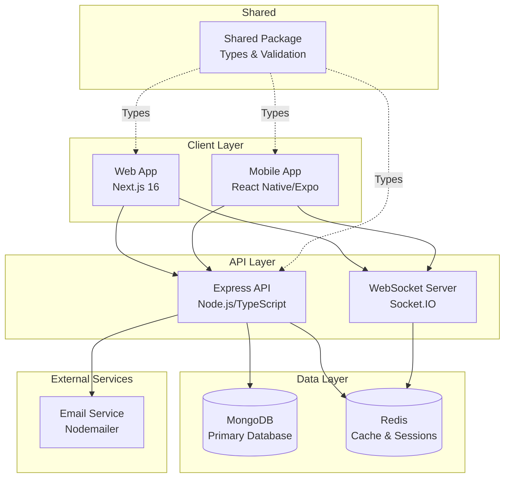

### Key Architectural Principles

1. **Type Safety** - End-to-end TypeScript with shared types
2. **Separation of Concerns** - Clear boundaries between layers
3. **Service-Oriented** - Modular backend services
4. **Stateless API** - JWT-based authentication, no server sessions
5. **Real-time Capable** - WebSocket support for live updates
6. **Scalable** - Horizontal scaling ready with Redis
7. **Testable** - Dependency injection and mocking support

---

## Backend Architecture

The backend follows a **layered service architecture** with clear separation of concerns.

### Architecture Layers

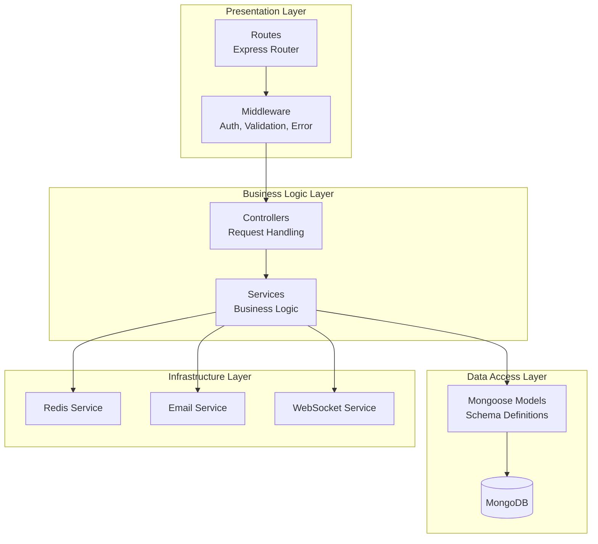

### Directory Structure Pattern

Each service follows a consistent structure:

```
services/
└── [service-name]/
    ├── [service].model.ts       # Mongoose schema & model
    ├── [service].service.ts     # Business logic
    ├── [service].controller.ts  # Request handlers
    ├── [service].routes.ts      # Route definitions
    └── [service].validation.ts  # Zod validation schemas
```

### Service Architecture Pattern

```typescript
// Flow: Route → Middleware → Controller → Service → Model → Database

// 1. Route Definition
router.post('/', authenticate, validate(schema), controller.create);

// 2. Middleware Chain
// - authenticate: Verify JWT token
// - validate: Validate request with Zod schema

// 3. Controller (Presentation Layer)
export const create = asyncHandler(async (req: AuthRequest, res: Response) => {
  const userId = req.user!.id;
  const item = await service.create(userId, req.body);
  sendSuccess(res, item, 'Created successfully', HTTP_STATUS.CREATED);
});

// 4. Service (Business Logic Layer)
export const create = async (userId: string, data: CreateDTO) => {
  // Business logic, validation, transformations
  return Model.create({ ...data, userId });
};

// 5. Model (Data Access Layer)
const schema = new Schema({ /* ... */ });
export default mongoose.model('Item', schema);
```

### Authentication Flow

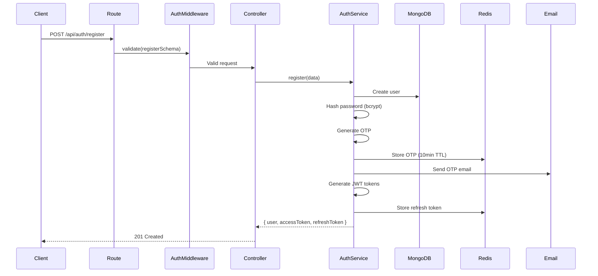

### WebSocket Architecture

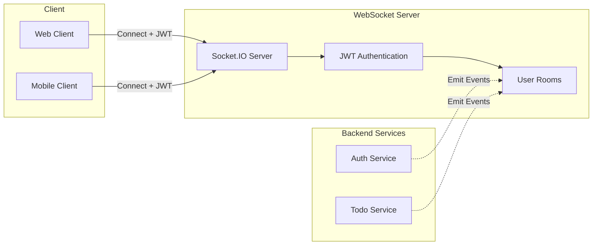

### Middleware Pipeline

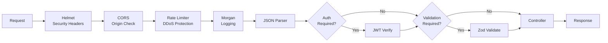

---

## Web Application Architecture

The web application uses **Next.js 16 App Router** with a modern React architecture.

### Application Structure

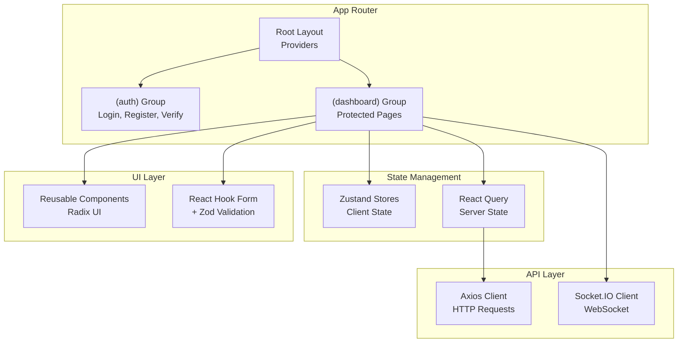

### State Management Strategy

```typescript
// 1. Client State (Zustand) - UI state, user preferences
const useAuthStore = create<AuthState>()(
  persist(
    (set) => ({
      user: null,
      token: null,
      setAuth: (user, token) => set({ user, token }),
      clearAuth: () => set({ user: null, token: null }),
    }),
    { name: 'auth-storage' }
  )
);

// 2. Server State (React Query) - API data, caching
const { data: todos, isLoading } = useQuery({
  queryKey: ['todos'],
  queryFn: () => todoApi.getAll(),
  staleTime: 5 * 60 * 1000, // 5 minutes
});

// 3. Form State (React Hook Form) - Form inputs
const form = useForm<TodoFormData>({
  resolver: zodResolver(todoSchema),
  defaultValues: { title: '', description: '' },
});
```

### Route Organization

```
app/
├── layout.tsx                 # Root layout (providers, fonts)
├── (auth)/                    # Auth route group (no layout)
│   ├── login/page.tsx
│   ├── register/page.tsx
│   ├── verify/page.tsx
│   └── reset-password/page.tsx
└── (dashboard)/               # Dashboard route group (with sidebar)
    ├── layout.tsx             # Dashboard layout (sidebar, header)
    ├── todos/page.tsx
    ├── profile/page.tsx
    └── [feature]/page.tsx     # Other feature pages
```

### API Client Architecture

```typescript
// Centralized API client with interceptors
const apiClient = axios.create({
  baseURL: process.env.NEXT_PUBLIC_API_URL,
});

// Request interceptor: Add auth token
apiClient.interceptors.request.use((config) => {
  const token = useAuthStore.getState().token;
  if (token) {
    config.headers.Authorization = `Bearer ${token}`;
  }
  return config;
});

// Response interceptor: Handle token refresh
apiClient.interceptors.response.use(
  (response) => response,
  async (error) => {
    if (error.response?.status === 401) {
      // Attempt token refresh
      const newToken = await refreshToken();
      if (newToken) {
        // Retry original request
        error.config.headers.Authorization = `Bearer ${newToken}`;
        return apiClient.request(error.config);
      }
      // Redirect to login
      useAuthStore.getState().clearAuth();
      window.location.href = '/login';
    }
    return Promise.reject(error);
  }
);
```

---

## Mobile Application Architecture

The mobile app uses **Expo Router** with file-based routing and native navigation.

### Navigation Architecture

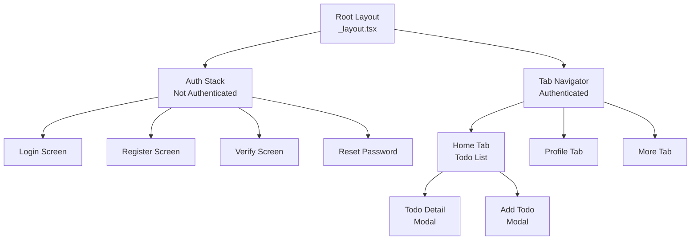

### State Persistence

```typescript
// MMKV Storage for fast, synchronous persistence
const storage = new MMKV();

// Zustand store with MMKV persistence
const useAuthStore = create<AuthState>()(
  persist(
    (set) => ({
      user: null,
      token: null,
      setAuth: (user, token) => set({ user, token }),
      clearAuth: () => set({ user: null, token: null }),
    }),
    {
      name: 'auth-storage',
      storage: {
        getItem: (name) => storage.getString(name) ?? null,
        setItem: (name, value) => storage.set(name, value),
        removeItem: (name) => storage.delete(name),
      },
    }
  )
);
```

### Screen Structure Pattern

```typescript
// Consistent screen structure
export default function TodoListScreen() {
  // 1. Hooks
  const { data: todos, isLoading } = useTodos();
  const navigation = useNavigation();
  
  // 2. Handlers
  const handleAddTodo = () => {
    navigation.navigate('AddTodo');
  };
  
  // 3. Render
  return (
    <ScreenLayout title="Todos">
      {isLoading ? <LoadingSpinner /> : <TodoList todos={todos} />}
      <FAB onPress={handleAddTodo} />
    </ScreenLayout>
  );
}
```

---

## Shared Package Architecture

The shared package provides **type-safe contracts** between all applications.

### Package Structure

```
shared/
├── src/
│   ├── types/
│   │   └── index.ts          # TypeScript interfaces
│   ├── validation/
│   │   └── index.ts          # Zod schemas
│   ├── constants/
│   │   └── index.ts          # Shared constants
│   ├── utils/
│   │   └── index.ts          # Helper functions
│   └── index.ts              # Main export
└── dist/                     # Compiled output
```

### Type Sharing Strategy

```typescript
// shared/src/types/index.ts
export interface User {
  _id: string;
  email: string;
  name: string;
  isEmailVerified: boolean;
  createdAt: Date;
  updatedAt: Date;
}

export interface Todo {
  _id: string;
  userId: string;
  title: string;
  description?: string;
  completed: boolean;
  priority: 'low' | 'medium' | 'high';
  dueDate?: Date;
  createdAt: Date;
  updatedAt: Date;
}

// Used in backend
import { User, Todo } from '@fullstack-master/shared';

// Used in web
import { User, Todo } from '@fullstack-master/shared';

// Used in mobile
import { User, Todo } from '@fullstack-master/shared';
```

### Validation Schema Sharing

```typescript
// shared/src/validation/index.ts
import { z } from 'zod';

export const registerSchema = z.object({
  email: z.string().email('Invalid email address'),
  password: z.string().min(8, 'Password must be at least 8 characters'),
  name: z.string().min(2, 'Name must be at least 2 characters'),
});

export const todoSchema = z.object({
  title: z.string().min(1, 'Title is required').max(100),
  description: z.string().max(500).optional(),
  priority: z.enum(['low', 'medium', 'high']),
  dueDate: z.date().optional(),
});

// Backend validation middleware uses these schemas
// Frontend forms use these schemas with React Hook Form
```

---

## Data Flow

### Create Todo Flow (End-to-End)

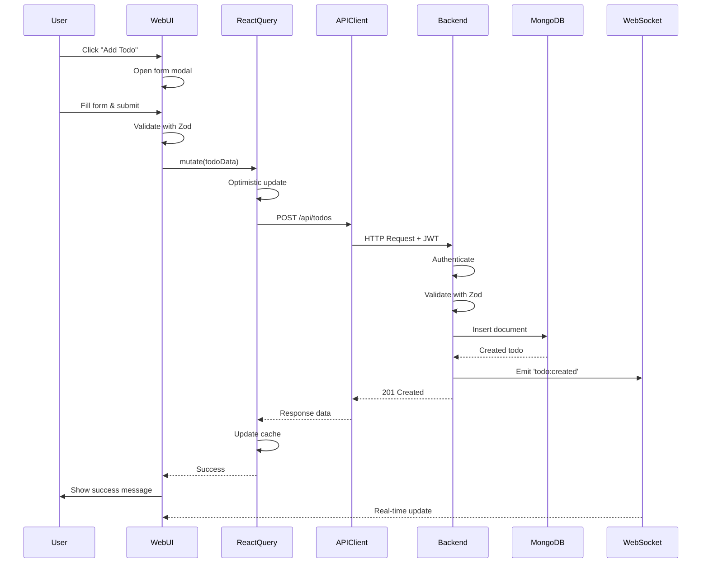

### Authentication Token Flow

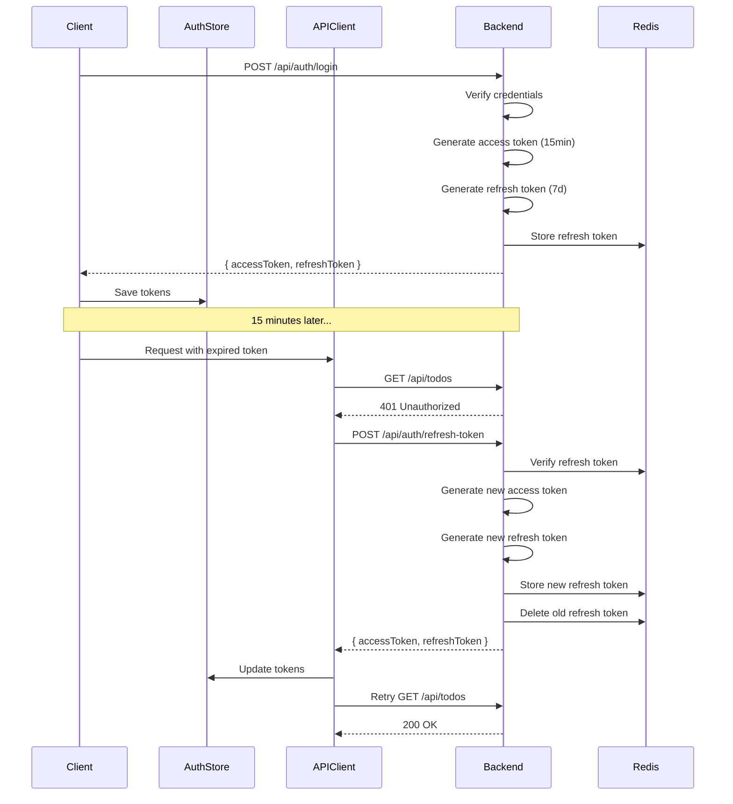

---

## Security Architecture

### Security Layers

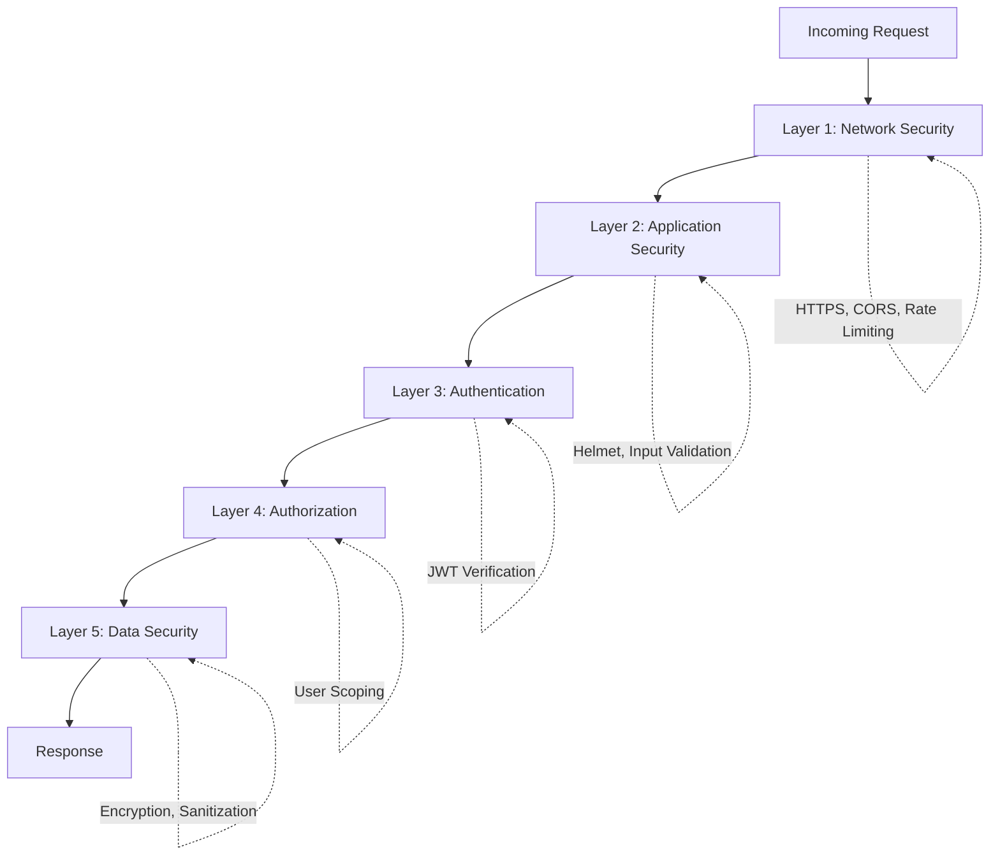

### Security Measures

1. **Network Security**
   - HTTPS in production
   - CORS with whitelist
   - Rate limiting (100 req/15min per IP)
   - DDoS protection

2. **Application Security**
   - Helmet.js security headers
   - Input validation with Zod
   - SQL injection prevention (Mongoose)
   - XSS protection

3. **Authentication**
   - JWT with RS256 algorithm
   - Bcrypt password hashing (10 rounds)
   - Refresh token rotation
   - OTP expiration (10 minutes)

4. **Authorization**
   - User-scoped data access
   - Protected routes with middleware
   - Role-based access control (ready)

5. **Data Security**
   - Passwords never stored in plain text
   - Sensitive data encryption
   - Redis TLS for cache
   - MongoDB encryption at rest

---

## Scalability Considerations

### Horizontal Scaling

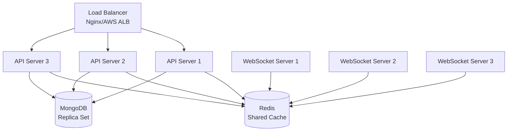

### Scaling Strategies

1. **Stateless API**
   - No server-side sessions
   - JWT tokens for authentication
   - Redis for shared state

2. **Database Scaling**
   - MongoDB replica sets for read scaling
   - Sharding for write scaling
   - Indexes on frequently queried fields

3. **Caching Strategy**
   - Redis for OTP and refresh tokens
   - React Query for client-side caching
   - CDN for static assets

4. **WebSocket Scaling**
   - Redis adapter for Socket.IO
   - Sticky sessions for load balancing
   - Horizontal pod autoscaling

5. **Microservices Ready**
   - Service-based architecture
   - Clear service boundaries
   - Easy to extract into separate services

---

## Technology Decisions

### Why These Technologies?

| Technology | Reason |
|------------|--------|
| **TypeScript** | Type safety, better DX, fewer runtime errors |
| **Express.js** | Mature, flexible, large ecosystem |
| **MongoDB** | Flexible schema, great for rapid development |
| **Redis** | Fast caching, session management, pub/sub |
| **JWT** | Stateless, scalable, mobile-friendly |
| **Zod** | Runtime validation, type inference, shared schemas |
| **Next.js** | SSR, SEO, great DX, Vercel deployment |
| **Expo** | Faster development, OTA updates, managed workflow |
| **Zustand** | Simple, performant, TypeScript-first |
| **React Query** | Server state management, caching, optimistic updates |

---

## Future Architecture Considerations

1. **Microservices Migration**
   - Extract services into separate deployments
   - API Gateway (Kong, AWS API Gateway)
   - Service mesh (Istio)

2. **Event-Driven Architecture**
   - Message queue (RabbitMQ, Kafka)
   - Event sourcing
   - CQRS pattern

3. **GraphQL API**
   - Alternative to REST
   - Better for complex queries
   - Reduced over-fetching

4. **Serverless Functions**
   - AWS Lambda, Vercel Functions
   - Cost-effective for low traffic
   - Auto-scaling

5. **Observability**
   - Logging (Winston, Pino)
   - Monitoring (Prometheus, Grafana)
   - Tracing (Jaeger, OpenTelemetry)
   - Error tracking (Sentry)

---

## Conclusion

The Nexus monorepo architecture is designed for:
- ✅ **Developer Experience** - Type safety, hot reload, clear patterns
- ✅ **Scalability** - Horizontal scaling, caching, stateless design
- ✅ **Maintainability** - Clear separation of concerns, consistent patterns
- ✅ **Security** - Multiple security layers, best practices
- ✅ **Flexibility** - Easy to add features, extract services, migrate

For implementation details, see:
- [PROJECT_STRUCTURE.md](./PROJECT_STRUCTURE.md) - Detailed file organization
- [DEVELOPMENT_GUIDE.md](./DEVELOPMENT_GUIDE.md) - Development workflow
- [CREATING_NEW_SERVICE.md](./CREATING_NEW_SERVICE.md) - Service creation guide
